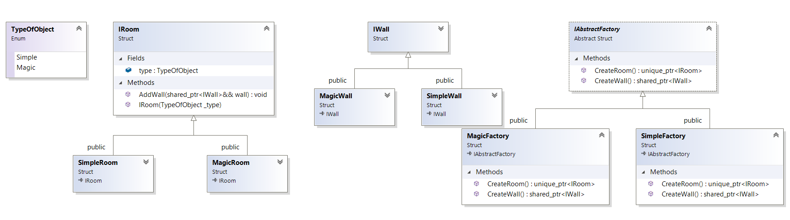

``` diff 
+[----------] 4 tests from AbstractFactory
+[ RUN      ] AbstractFactory.InitSimpleMaze

! ********************************************************************************
! Simple game: we have rooms and walls in our maze.
! Maze can contain only one type of walls and rooms.
! Both of them should have similar type. Let's create simple maze
! ********************************************************************************
std::unique_ptr<IRoom> room = std::make_unique<SimpleRoom>()
room->AddWall(std::make_shared<SimpleWall>());
# For room Simple added wall Simple
room->AddWall(std::make_shared<SimpleWall>());
# For room Simple added wall Simple
room->AddWall(std::make_shared<SimpleWall>());
# For room Simple added wall Simple
room->AddWall(std::make_shared<SimpleWall>());
# For room Simple added wall Simple
+[       OK ] AbstractFactory.InitSimpleMaze (5 ms)
+[ RUN      ] AbstractFactory.InitMagic

! ********************************************************************************
! Ok, now copy-paste and create another room with another walls
! ********************************************************************************
std::unique_ptr<IRoom> room = std::make_unique<MagicRoom>();
room->AddWall(std::make_shared<MagicWall>());
# For room Magic added wall Magic
room->AddWall(std::make_shared<SimpleWall>());
# For room Magic added wall Simple
-D:\Coding\Patterns\Creational\AbstractFactory\AbstractFactory.cpp(36): error: Expected equality of these values:
  type
    Which is: Magic
  wall->type
    Which is: Simple
room->AddWall(std::make_shared<MagicWall>());
# For room Magic added wall Magic
room->AddWall(std::make_shared<MagicWall>());
# For room Magic added wall Magic

! ********************************************************************************
! Looks like i skipped one wall...
! But what if we will have a lot of functions? Do i need to change it every time?
! ********************************************************************************
-[  FAILED  ] AbstractFactory.InitMagic (17 ms)
+[ RUN      ] AbstractFactory.InitWithFactory

! ********************************************************************************
! Lets use abstract factory
! ********************************************************************************
std::unique_ptr<IAbstractFactory> factory = std::make_unique<MagicFactory>();
std::unique_ptr<IRoom> room = factory->CreateRoom();
room->AddWall(factory->CreateWall());
# For room Magic added wall Magic
room->AddWall(factory->CreateWall());
# For room Magic added wall Magic
room->AddWall(factory->CreateWall());
# For room Magic added wall Magic
room->AddWall(factory->CreateWall());
# For room Magic added wall Magic

! ********************************************************************************
! Looks much better. I guess, we can just move it into separate function!
! ********************************************************************************
+[       OK ] AbstractFactory.InitWithFactory (33 ms)
+[ RUN      ] AbstractFactory.InitWithSeparateFunction

! ********************************************************************************
! Lets extract method and put in factory!
! ********************************************************************************
CreateWithFactory(std::make_unique<MagicFactory>());
# For room Magic added wall Magic
# For room Magic added wall Magic
# For room Magic added wall Magic
# For room Magic added wall Magic

! ********************************************************************************
! And another one!
! ********************************************************************************
CreateWithFactory(std::make_unique<SimpleFactory>());
# For room Simple added wall Simple
# For room Simple added wall Simple
# For room Simple added wall Simple
# For room Simple added wall Simple

! ********************************************************************************
! Awesome!
! ********************************************************************************
+[       OK ] AbstractFactory.InitWithSeparateFunction (30 ms)
+[----------] 4 tests from AbstractFactory (97 ms total)

```

