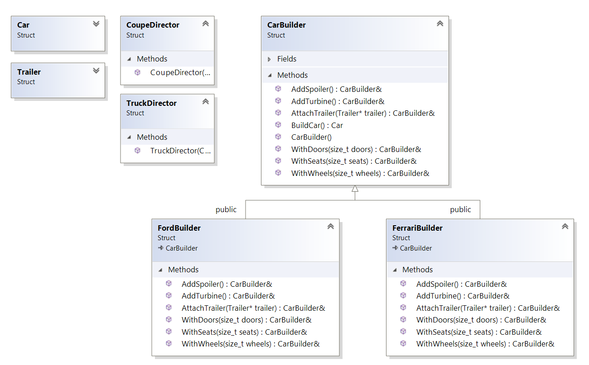

``` diff 
+[----------] 3 tests from Builder
+[ RUN      ] Builder.CreateACar

! ********************************************************************************
! Ok, let's imagine, that we have a factory of cars different types.
! How do we can build car? Let's build simple car
! ********************************************************************************
Car target_car(4, 4, 4, nullptr, false, false);
# Builded car with 4 doors, 4 wheels, 4 seats, trailer exist: false, spoiler: false, turbine: false

! ********************************************************************************
! But what about trucks?
! ********************************************************************************
Trailer trailer;
Car truck_car(2, 6, 2, &trailer, false, false);
# Builded car with 2 doors, 6 wheels, 2 seats, trailer exist: true, spoiler: false, turbine: false

! ********************************************************************************
! Ok, but what about sport-car with spoiler?
! ********************************************************************************
Car sport_car(2, 4, 2, nullptr, true, false);
# Builded car with 2 doors, 4 wheels, 2 seats, trailer exist: false, spoiler: true, turbine: false

! ********************************************************************************
! With turbine but without spoiler?
! ********************************************************************************
Car sport_car_with_turbine(4, 4, 4, nullptr, false, true);
# Builded car with 4 doors, 4 wheels, 4 seats, trailer exist: false, spoiler: false, turbine: true

! ********************************************************************************
! Ok, same, but with 2 doors!
! ********************************************************************************
Car sport_car_with_turbine_2_doors(4, 2, 4, nullptr, false, true);
# Builded car with 4 doors, 2 wheels, 4 seats, trailer exist: false, spoiler: false, turbine: true
-D:\Coding\Patterns\Creational\Builder\Builder.cpp(56): error: Expected equality of these values:
  sport_car_with_turbine_2_doors.m_count_of_seats
    Which is: 4
  2

! ********************************************************************************
! Wait... Looks like i've missed field.. Oh, it is really hard to understand, where is what!
!  More it looks like a huge constructor!
! In the last one i've not used spoiler and track... Why do i need to put it? And in the any other cases
! Oh... What if i will add some other features like color, height, power, size of spoiler, and more others. Do i need to fill it every time??
! ********************************************************************************
-[  FAILED  ] Builder.CreateACar (41 ms)
+[ RUN      ] Builder.BuildViaBuilder

! ********************************************************************************
! Let's try again with builder!
! ********************************************************************************
CarBuilder().WithDoors(4).WithSeats(2).WithWheels(4).AddSpoiler().AddTurbine().BuildCar()
# Builded car with 4 doors, 4 wheels, 2 seats, trailer exist: false, spoiler: true, turbine: true

! ********************************************************************************
! Much better!
! ********************************************************************************
CarBuilder().WithWheels(4).WithDoors(2).WithSeats(2).AttachTrailer(&trailer).BuildCar()
# Builded car with 2 doors, 4 wheels, 2 seats, trailer exist: true, spoiler: false, turbine: false

! ********************************************************************************
! Awesome!
! ********************************************************************************
+[       OK ] Builder.BuildViaBuilder (26 ms)
+[ RUN      ] Builder.BuilderAndDirector

! ********************************************************************************
! This pattern can be used in the other form via adding director.
! In the such a situation builder is responsible for 'creating' suitable materials and parts
! And director is responsible for 'how to create' some forms
! For example, building of any 'coupe' car is the same: 4 wheels, 2 doors, but it can use different types of metal of interior.
! Let's imagine, that last things depends from the brand, then build ferrari coupe and ford truck
! ********************************************************************************
CoupeDirector ferrari_coupe{ FerrariBuilder() }
# Add Ferrari's wheels
# Add Ferrari's seats
# Add Ferrari's door
# Add Ferrari's spoiler
# Add Ferrari's turbine
# Builded car with 2 doors, 4 wheels, 2 seats, trailer exist: false, spoiler: true, turbine: true
TruckDirector ford_truck{ FordBuilder() }
# Add Ford's wheels
# Add Ford's seats
# Add Ford's door
# Add Ford's trailer
# Builded car with 2 doors, 6 wheels, 2 seats, trailer exist: true, spoiler: false, turbine: false

! ********************************************************************************
! Awesome! Try to inverse!
! ********************************************************************************
CoupeDirector ford_coupe{ FordBuilder() }
# Add Ford's wheels
# Add Ford's seats
# Add Ford's door
# Add Ford's spoiler
# Add Ford's turbine
# Builded car with 2 doors, 4 wheels, 2 seats, trailer exist: false, spoiler: true, turbine: true
TruckDirector ferrari_truck{ FerrariBuilder() }
# Add Ferrari's wheels
# Add Ferrari's seats
# Add Ferrari's door
# Add Ferrari's trailer
# Builded car with 2 doors, 6 wheels, 2 seats, trailer exist: true, spoiler: false, turbine: false
+[       OK ] Builder.BuilderAndDirector (55 ms)
+[----------] 3 tests from Builder (134 ms total)

```
