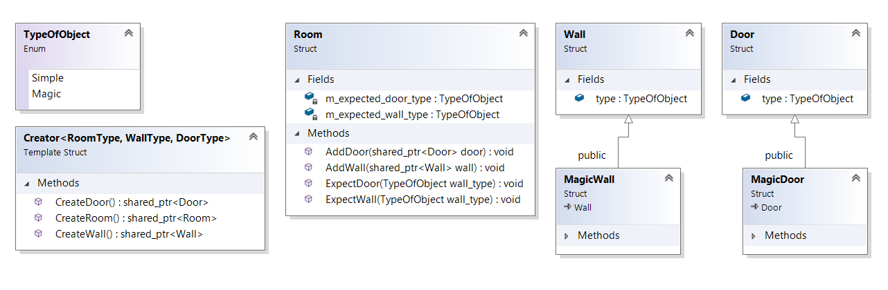

``` diff 
+[----------] 3 tests from FactoryMethod
+[ RUN      ] FactoryMethod.Init

! ********************************************************************************
! Let's imagine, that we build a simple maze!
! ********************************************************************************

! ********************************************************************************
! Create room with 3 walls and 1 room
! ********************************************************************************
auto room1 = std::make_shared<Room>();
room1->AddWall(std::make_shared<Wall>());
# Added wall: Simple
room1->AddWall(std::make_shared<Wall>());
# Added wall: Simple
room1->AddWall(std::make_shared<Wall>());
# Added wall: Simple
room1->AddDoor(std::make_shared<Door>());
# Added door: Simple

! ********************************************************************************
! Create room with 2 walls and 2 rooms
! ********************************************************************************
auto room2 = std::make_shared<Room>();
room2->AddWall(std::make_shared<Wall>());
# Added wall: Simple
room2->AddWall(std::make_shared<Wall>());
# Added wall: Simple
room2->AddDoor(std::make_shared<Door>());
# Added door: Simple
room2->AddDoor(std::make_shared<Door>());
# Added door: Simple
+[       OK ] FactoryMethod.Init (18 ms)
+[ RUN      ] FactoryMethod.InitWithAnotherWalls

! ********************************************************************************
! Ok, now let's create same maze but with magic walls!
! ********************************************************************************
# Create room with 3 walls and 1 room
auto room1 = std::make_shared<Room>()
room1->ExpectWall(Magic)
room1->AddWall(std::make_shared<MagicWall>())
# Added wall: Magic
room1->AddWall(std::make_shared<MagicWall>())
# Added wall: Magic
room1->AddWall(std::make_shared<MagicWall>())
# Added wall: Magic
room1->AddDoor(std::make_shared<Door>())
# Added door: Simple
# Create room with 2 walls and 2 rooms
auto room2 = std::make_shared<Room>()
room2->ExpectWall(Magic)
room2->AddWall(std::make_shared<Wall>())
# Added wall: Simple
-D:\Coding\Patterns\Creational\FactoryMethod\FactoryMethod.cpp(32): error: Expected equality of these values:
  wall->type
    Which is: Simple
  m_expected_wall_type
    Which is: Magic
room2->AddWall(std::make_shared<MagicWall>())
# Added wall: Magic
room2->AddDoor(std::make_shared<Door>())
# Added door: Simple
room2->AddDoor(std::make_shared<Door>())
# Added door: Simple

! ********************************************************************************
! Look's like I forgot to change one line.... It is not cool
! ********************************************************************************
-[  FAILED  ] FactoryMethod.InitWithAnotherWalls (72 ms)
+[ RUN      ] FactoryMethod.ApplyFactoryMethod

! ********************************************************************************
! Let's use factory method in this case!
! ********************************************************************************

! ********************************************************************************
! Let's create simple rooms, magic walls and simple doors!
! ********************************************************************************
Creator<Room, MagicWall, Door> creator;
auto room1 = creator.CreateRoom()
room1->ExpectWall(Magic)
room1->AddWall(creator.CreateWall())
# Added wall: Magic
room1->AddWall(creator.CreateWall())
# Added wall: Magic
room1->AddWall(creator.CreateWall())
# Added wall: Magic
room1->AddDoor(creator.CreateDoor())
# Added door: Simple
# Create room with 2 walls and 2 rooms
auto room2 = std::make_shared<Room>()
room2->ExpectWall(Magic)
room2->AddWall(creator.CreateWall())
# Added wall: Magic
room2->AddWall(creator.CreateWall())
# Added wall: Magic
room2->AddDoor(creator.CreateDoor())
# Added door: Simple
room2->AddDoor(creator.CreateDoor())
# Added door: Simple

! ********************************************************************************
! Ok, now let's create simple rooms, simple walls, but magic doors!
! ********************************************************************************
Creator<Room, Wall, MagicDoor> creator;
auto room1 = creator.CreateRoom()
room1->ExpectDoor(Magic)
room1->AddWall(creator.CreateWall())
# Added wall: Simple
room1->AddWall(creator.CreateWall())
# Added wall: Simple
room1->AddWall(creator.CreateWall())
# Added wall: Simple
room1->AddDoor(creator.CreateDoor())
# Added door: Magic
# Create room with 2 walls and 2 rooms
auto room2 = std::make_shared<Room>()
room2->ExpectDoor(Magic)
room2->AddWall(creator.CreateWall())
# Added wall: Simple
room2->AddWall(creator.CreateWall())
# Added wall: Simple
room2->AddDoor(creator.CreateDoor())
# Added door: Magic
room2->AddDoor(creator.CreateDoor())
# Added door: Magic
+[       OK ] FactoryMethod.ApplyFactoryMethod (87 ms)
+[----------] 3 tests from FactoryMethod (188 ms total)

```
