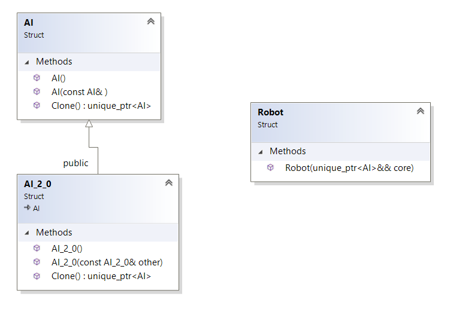

``` diff 
+[----------] 3 tests from Prototype
+[ RUN      ] Prototype.Init

! ********************************************************************************
! Let's imagine we have a factory of the AI robots. We build AI, spend a lot of time for learning it and then put into all our robots
! Then we create new AI and repeat it from the start.
! Process of creation new AI is very expensive by the time and money and we need to copy AI core every time
! ********************************************************************************
auto original_core = std::make_unique<AI>();
# Long time of building and configuring new AI core... Completed in 20 days
auto clone_1 = std::make_unique<AI>(*original_core);
# Cloning internal part of AI.... Completed in 1 sec.
auto robot_1 = std::make_unique<Robot>(clone_1);
# Core attached to robot

! ********************************************************************************
! Awesome! Let's create one more robot!
! ********************************************************************************
auto clone_2 = std::make_unique<AI>(*original_core);
# Cloning internal part of AI.... Completed in 1 sec.
auto robot_2 = std::make_unique<Robot>(clone_2);
# Core attached to robot
+[       OK ] Prototype.Init (3 ms)
+[ RUN      ] Prototype.InitWithOneMoreAI

! ********************************************************************************
! All is fine, but now we start to create not only new robots, but and AIs too
! ********************************************************************************
auto original_core = std::make_unique<AI_2_0>()
# Long time of building and configuring new AI core... Completed in 20 days
# Version: 2_0: Creating additional parts... Completed in 5 days.

! ********************************************************************************
! Great! let's copy old code for creating new robots!
! ********************************************************************************
std::unique_ptr<AI> clone_1 = std::make_unique<AI_2_0>(*original_core);
# Cloning internal part of AI.... Completed in 1 sec.
# Version 2_0: Configure additional parts... Completed in 3 sec.
auto robot_1 = std::make_unique<Robot>(clone_1);
# Core attached to robot

! ********************************************************************************
! Awesome! Let's create one more robot!
! ********************************************************************************
std::unique_ptr<AI> clone_2 = std::make_unique<AI_2_0>(*original_core);
# Cloning internal part of AI.... Completed in 1 sec.
# Version 2_0: Configure additional parts... Completed in 3 sec.
auto robot_2 = std::make_unique<Robot>(clone_2);
# Core attached to robot
+[       OK ] Prototype.InitWithOneMoreAI (32 ms)
+[ RUN      ] Prototype.ExtractToProtype

! ********************************************************************************
! All is good, but this approach has problems: in the moment of instatiation we must to need original type of AI...
! As a result, it is not possible to extract process of creation robots in the separate function...
! ********************************************************************************
std::unique_ptr<AI> original_core = std::make_unique<AI_2_0>()
# Long time of building and configuring new AI core... Completed in 20 days
# Version: 2_0: Creating additional parts... Completed in 5 days.
std::unique_ptr<AI> clone_1 = original_core->Clone();
# Cloning internal part of AI.... Completed in 1 sec.
# Version 2_0: Configure additional parts... Completed in 3 sec.
auto robot_1 = std::make_unique<Robot>(clone_1);
# Core attached to robot

! ********************************************************************************
! Awesome! Let's create one more robot!
! ********************************************************************************
std::unique_ptr<AI> clone_2 = original_core->Clone();
# Cloning internal part of AI.... Completed in 1 sec.
# Version 2_0: Configure additional parts... Completed in 3 sec.
auto robot_2 = std::make_unique<Robot>(clone_2);
# Core attached to robot

! ********************************************************************************
! Now we can use it with any types of AI without knowing about specific type!
! ********************************************************************************
+[       OK ] Prototype.ExtractToProtype (33 ms)
+[----------] 3 tests from Prototype (75 ms total)

```
