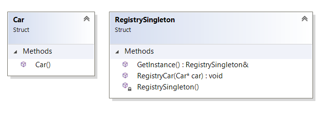

``` diff 
+[----------] 4 tests from Singleton
+[ RUN      ] Singleton.Init

! ********************************************************************************
! Ok, let's imagine, we have a factory of cars and global registry of this cars by uniq id.
! ********************************************************************************
Registry registry
Car car_1
Car car_2
Car car_3
registry.RegistryCar(&car_1)
# Added new uniq number of car
registry.RegistryCar(&car_3)
# Added new uniq number of car
registry.RegistryCar(&car_2)
# Added new uniq number of car
+[       OK ] Singleton.Init (2 ms)
+[ RUN      ] Singleton.Problem

! ********************************************************************************
! All works fine, but it looks like we have problem:
!  if we have some hierarchy of functions and classes, then we need to put this registry inside all of them
! For example, let's create function for creating N cars in line
! ********************************************************************************
Registry registry
CreateNCars(2, registry)
# >>> Start function CreateNCars
for (int i = 0; i < count; ++i) { Car car; registry.RegistryCar(&car); }
# Added new uniq number of car
# Added new uniq number of car
# <<<< End of function CreateNCars
CreateNCars(3, registry)
# >>> Start function CreateNCars
for (int i = 0; i < count; ++i) { Car car; registry.RegistryCar(&car); }
# Added new uniq number of car
# Added new uniq number of car
# Added new uniq number of car
# <<<< End of function CreateNCars

! ********************************************************************************
! Not bad, but... it is not cool to put it everywhere...
! ********************************************************************************
+[       OK ] Singleton.Problem (34 ms)
+[ RUN      ] Singleton.GlobalVar

! ********************************************************************************
! One of the possible solution: create global variable!
! ********************************************************************************
CreateNCarsWithGlobal(2)
# >>> Start function CreateNCarsWithGlobal
for (int i = 0; i < count; ++i) { Car car; g_registry.RegistryCar(&car); }
# Added new uniq number of car
# Added new uniq number of car
# <<<< End of function CreateNCarsWithGlobal
CreateNCarsWithGlobal(3)
# >>> Start function CreateNCarsWithGlobal
for (int i = 0; i < count; ++i) { Car car; g_registry.RegistryCar(&car); }
# Added new uniq number of car
# Added new uniq number of car
# Added new uniq number of car
# <<<< End of function CreateNCarsWithGlobal

! ********************************************************************************
! Much better, but... we have a requirements: only one registry should be able in the system, but now i can create another one registry..
! ********************************************************************************
Registry one_more_registry
Registry one_more_more_registry

! ********************************************************************************
! Not cool! How to control it?
! ********************************************************************************
+[       OK ] Singleton.GlobalVar (55 ms)
+[ RUN      ] Singleton.Singleton

! ********************************************************************************
! Solution: to add to the Registry function 'GetInstance', that will create static object and return ref to it
! As a result, on the second call it will return the same object as in the first one. As a result, it is like a global var
! But as a result it is possible to make Constructor a private
! ********************************************************************************
auto & registry = RegistrySingleton::GetInstance()
Car car_1
Car car_2
Car car_3
registry.RegistryCar(&car_1)
# Added new uniq number of car
registry.RegistryCar(&car_3)
# Added new uniq number of car
registry.RegistryCar(&car_2)
# Added new uniq number of car
CreateNCarsSingleton(2)
# >>> Start function CreateNCarsSingleton
for (int i = 0; i < count; ++i) { Car car; RegistrySingleton::GetInstance().RegistryCar(&car); }
# Added new uniq number of car
# Added new uniq number of car
# <<<< End of function CreateNCarsSingleton
+[       OK ] Singleton.Singleton (40 ms)
+[----------] 4 tests from Singleton (142 ms total)

```