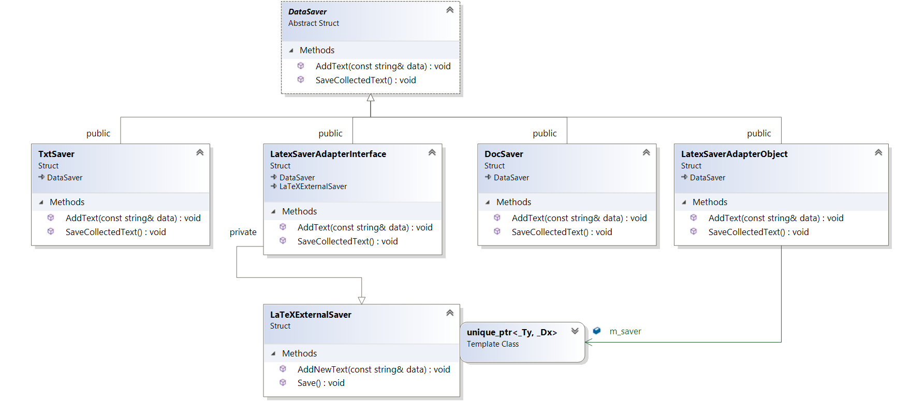

``` diff 
+[----------] 3 tests from Adapter
+[ RUN      ] Adapter.Init

! ********************************************************************************
! Let's image, that we have a bunch of different savers of text data. Our task -> Save input data to all available formats
! ********************************************************************************
std::vector<std::unique_ptr<DataSaver>> savers
savers.emplace_back(std::make_unique<TxtSaver>())
savers.emplace_back(std::make_unique<DocSaver>())
for (const auto& text : { "First", "Second", "End" }) for (auto& saver : savers) saver->AddText(text);
# Add to TxtSaver: First
# Add to DocSaver: First
# Add to TxtSaver: Second
# Add to DocSaver: Second
# Add to TxtSaver: End
# Add to DocSaver: End
for (auto& saver : savers) saver->SaveCollectedText()
# TxtSaver Save;
# DocSaver Save;
+[       OK ] Adapter.Init (5 ms)
+[ RUN      ] Adapter.Problem

! ********************************************************************************
! Let's imagine then, that we have new format and special library for this format, but problem is that new format has non-compatible interface and we can't use inheritance...
! Naive solution: use it as is
! ********************************************************************************
std::vector<std::unique_ptr<DataSaver>> savers
savers.emplace_back(std::make_unique<TxtSaver>())
savers.emplace_back(std::make_unique<DocSaver>())
auto latex = std::make_unique<LaTeXExternalSaver>()
for (const auto& text : { "First", "Second", "End" }) { for (auto& saver : savers) { saver->AddText(text); } latex->AddNewText(text); }
# Add to TxtSaver: First
# Add to DocSaver: First
# Add to LaTeXExternalSaver: First
# Add to TxtSaver: Second
# Add to DocSaver: Second
# Add to LaTeXExternalSaver: Second
# Add to TxtSaver: End
# Add to DocSaver: End
# Add to LaTeXExternalSaver: End
for (auto& saver : savers) { saver->SaveCollectedText(); }
# TxtSaver Save;
# DocSaver Save;
latex->Save()
# LaTeXExternalSaver Save;

! ********************************************************************************
!  It looks so ugly... What if we will have one more external savers??
! ********************************************************************************
+[       OK ] Adapter.Problem (47 ms)
+[ RUN      ] Adapter.Solution

! ********************************************************************************
! Let's create an adapter over our external saver for unifying interfaces
! ********************************************************************************
std::vector<std::unique_ptr<DataSaver>> savers
savers.emplace_back(std::make_unique<TxtSaver>())
savers.emplace_back(std::make_unique<DocSaver>())
savers.emplace_back(std::make_unique<LatexSaverAdapterInterface>())
for (const auto& text : { "First", "Second", "End" }) for (auto& saver : savers) saver->AddText(text);
# Add to TxtSaver: First
# Add to DocSaver: First
# Add to LaTeXExternalSaver: First
# Add to TxtSaver: Second
# Add to DocSaver: Second
# Add to LaTeXExternalSaver: Second
# Add to TxtSaver: End
# Add to DocSaver: End
# Add to LaTeXExternalSaver: End
for (auto& saver : savers) saver->SaveCollectedText()
# TxtSaver Save;
# DocSaver Save;
# LaTeXExternalSaver Save;
+[       OK ] Adapter.Solution (39 ms)
+[----------] 3 tests from Adapter (100 ms total)

```

