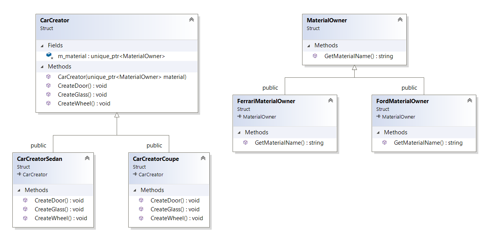

``` diff 
+[----------] 3 tests from Bridge
+[ RUN      ] Bridge.Init

! ********************************************************************************
! Let's imagine, that we have factory of cars. Our factory owns special robots for building cars and components
! ********************************************************************************
CarCreator creator
creator.CreateDoor()
# Created new door
#
creator.CreateGlass()
# Created new glass
#
creator.CreateWheel()
# Created new wheel
#
+[       OK ] Bridge.Init (17 ms)
+[ RUN      ] Bridge.MoreDifficult

! ********************************************************************************
! Also we have different types of our cars.
! ********************************************************************************
CarCreatorSedan creator_sedan
creator_sedan.CreateDoor()
# Created new door for sedan
#
creator_sedan.CreateGlass()
# Created new glass for sedan
#
creator_sedan.CreateWheel()
# Created new wheel for sedan
#
CarCreatorCoupe creator_coupe
creator_coupe.CreateDoor()
# Created new door for coupe
#
creator_coupe.CreateGlass()
# Created new glass for coupe
#
creator_coupe.CreateWheel()
# Created new wheel for coupe
#
+[       OK ] Bridge.MoreDifficult (160 ms)
+[ RUN      ] Bridge.MoreDifficultWithMterial

! ********************************************************************************
! Also we have different types of material's owners for our cars. Naive solution is to add inheritance like...
! CarCreatorSedanFord
! CarCreatorSedanFerrari
! CarCreatoSedanKia
! CarCreatorCoupeFord
! CarCreatorCoupeFerrari
! CarCreatorCoupeKia
!
! Looks so so ugly.. and now we have only 2 types of cars and 3 types of material's owners, what is next??
! ********************************************************************************

! ********************************************************************************
! Much better to use patter bridge when we have two separate hierarchies and  'bridge' between them
! ********************************************************************************
CarCreatorSedan creator_ford{std::make_unique<FordMaterialOwner>()}
creator_ford.CreateDoor()
# Created new door for sedan
# MaterialOwner: Ford
creator_ford.CreateGlass()
# Created new glass for sedan
# MaterialOwner: Ford
creator_ford.CreateWheel()
# Created new wheel for sedan
# MaterialOwner: Ford
CarCreatorSedan creator_ferrari{ std::make_unique<FerrariMaterialOwner>() }
creator_ferrari.CreateDoor()
# Created new door for sedan
# MaterialOwner: Ferrari
creator_ferrari.CreateGlass()
# Created new glass for sedan
# MaterialOwner: Ferrari
creator_ferrari.CreateWheel()
# Created new wheel for sedan
# MaterialOwner: Ferrari
+[       OK ] Bridge.MoreDifficultWithMterial (83 ms)
+[----------] 3 tests from Bridge (282 ms total)

```

