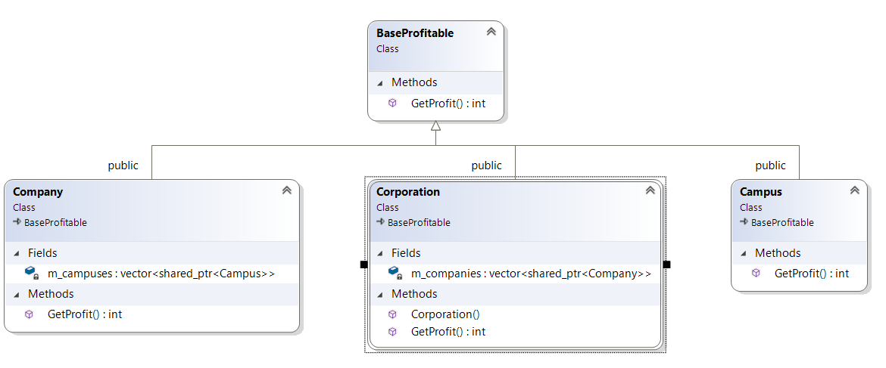

``` diff 
+[----------] 2 tests from Composite
+[ RUN      ] Composite.Init

! ********************************************************************************
! Let's imagine, that we have a lot of big companies, each company contains a lot of campuses and etc.
! We want to determine, what is profit we got during this day
! ********************************************************************************
Company_A company_a
Company_B company_b
auto profit = company_a.GetProfit() + company_b.GetMyProfit()
return m_campus_1.GetWholeProfit() + m_campus_2.Get_Profit()
return m_campus_1.GetMyWholeProfit() + m_campus_2.Get_my_Profit()

! ********************************************************************************
! Cool, we solve our problem, but... it looks not comfortable, that each 'separate class' has a specific function for it and we need to call each of them manually..
! ********************************************************************************
+[       OK ] Composite.Init (3 ms)
+[ RUN      ] Composite.Solution

! ********************************************************************************
! What if we created a base class, that can return a profit of self? And inherit all of our classes from it? Then we can call only one function from any type of class
! ********************************************************************************
Corporation corporation{}
auto profit = corporation.GetProfit()
# Return profit from whole corporation
return std::accumulate(m_companies.begin(), m_companies.end(), 0, [](int counter, auto& campuse) {return counter + campuse->GetProfit(); })
# Return profit from whole company
return std::accumulate(m_campuses.begin(), m_campuses.end(), 0, [](int counter, auto& campuse) {return counter + campuse->GetProfit(); })
# Return profit from campus
# Return profit from campus
# Return profit from whole company
return std::accumulate(m_campuses.begin(), m_campuses.end(), 0, [](int counter, auto& campuse) {return counter + campuse->GetProfit(); })
# Return profit from campus
# Return profit from campus
+[       OK ] Composite.Solution (33 ms)
+[----------] 2 tests from Composite (41 ms total)

```

