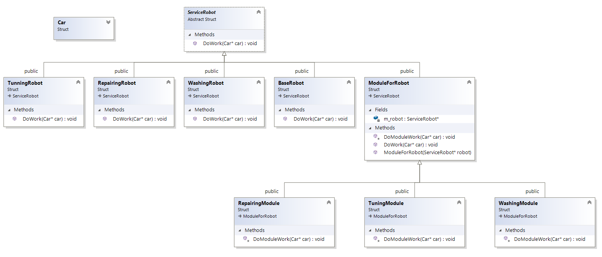

``` diff 
+[----------] 2 tests from Decorator
+[ RUN      ] Decorator.Init

! ********************************************************************************
! Let's imagine we have a automotive robots for maintaining cars.
! They can wash, repair, boost perfomance and etc. For this one we have different robots. Let's imagine we want to apply all robots on one car..
! ********************************************************************************
Car car{}
WashingRobot wash
RepairingRobot repair
TunningRobot tune
wash.DoWork(&car)
# Wash car...
repair.DoWork(&car)
# Repair car...
tune.DoWork(&car)
# Tune car...
+[       OK ] Decorator.Init (6 ms)
+[ RUN      ] Decorator.Problem

! ********************************************************************************
! But we have a problem: with new rules we can apply only one robot to one machine... But we can configure them before work...
! How to solve it? Iheritance? Looks like we have combination boom! We need to create all possible combination of robots..
!  Wash, Repair, Tune.. WashRepair, WashTune, RepairTune and etc... (also it is possible to do work in different order)
! ********************************************************************************

! ********************************************************************************
! Correct solution to do robots 'modular' (it contains a lot of modules). For example, module for washing, module for tuning and etc..
! ********************************************************************************
BaseRobot robot
Car car
auto moduled_robot = TuningModule{ new WashingModule{new RepairingModule{&robot}}}
moduled_robot.DoWork(&car)
# Do some base work...
# Repairing...
# Washing...
# Tuning...
+[       OK ] Decorator.Problem (33 ms)
+[----------] 2 tests from Decorator (42 ms total)

```

