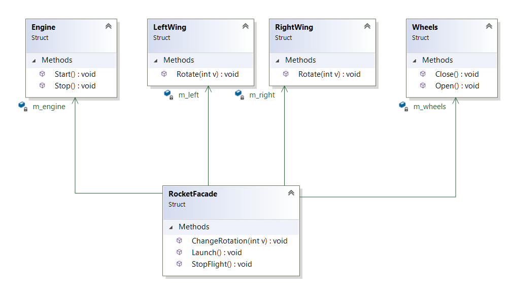

``` diff 
+[----------] 2 tests from Facade
+[ RUN      ] Facade.Init

! ********************************************************************************
! Let's imagine we have a space rocket. It rocket contains a lot of submodules. We can control it via special interface-framewrk provided by company...
! ********************************************************************************
LeftWing left{}
RightWing right{}
Engine engine{}
Wheels wheels{}

! ********************************************************************************
! Lets imagine we want to launch our rocket
! ********************************************************************************
engine.Start()
# Launch engine
left.Rotate(90)
# Rotate Left Wing to 90
right.Rotate(90)
# Rotate Right Wing to 90
"Wait..."
wheels.Close()
# Close wheels

! ********************************************************************************
! Then we need to change target rotation...
! ********************************************************************************
left.Rotate(110)
# Rotate Left Wing to 110
right.Rotate(110)
# Rotate Right Wing to 110

! ********************************************************************************
! And then finish our flight...
! ********************************************************************************
wheels.Open()
# Open wheels
engine.Stop()
# Stop engine
left.Rotate(0)
# Rotate Left Wing to 0
right.Rotate(0)
# Rotate Right Wing to 0

! ********************************************************************************
! Awesome, but... looks like it is really hard to use our 'rocket-framework'
! ********************************************************************************
+[       OK ] Facade.Init (48 ms)
+[ RUN      ] Facade.Solution

! ********************************************************************************
! For improving usability we can wrap it to RocketFacade - special class that will handle whole rocket with simple interface instead of controlling each component manually...
! ********************************************************************************
RocketFacade facade{}
facade.Launch()
# Launch engine
# Rotate Left Wing to 90
# Rotate Right Wing to 90
# Close wheels
facade.ChangeRotation(110)
# Rotate Left Wing to 110
# Rotate Right Wing to 110
facade.StopFlight()
# Open wheels
# Stop engine
# Rotate Left Wing to 0
# Rotate Right Wing to 0
+[       OK ] Facade.Solution (33 ms)
+[----------] 2 tests from Facade (87 ms total)

```

