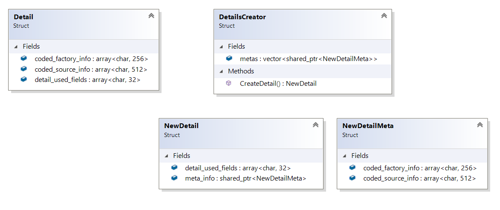

``` diff 
+[----------] 2 tests from FlyWeight
+[ RUN      ] FlyWeight.Init

! ********************************************************************************
! Let's imagine we have a lot of factories of details for cars.. By the global rules each detail should contains a way to determine the source of factory
! ********************************************************************************
Detail detail

! ********************************************************************************
! We have all required info:
! ********************************************************************************
detail.detail_used_fields
detail.coded_factory_info
detail.coded_source_info
std::cout << "Sizeof: " << sizeof(detail) << " SizeOf detail fields:" << sizeof(detail.detail_used_fields) << std::endl
Sizeof: 800 SizeOf detail fields:32

! ********************************************************************************
! Looks like we spend a lot o memory for storing factory info... moreover, all details from one factory will contains the same info... Looks like probem of memory...
! ********************************************************************************
+[       OK ] FlyWeight.Init (4 ms)
+[ RUN      ] FlyWeight.Solution

! ********************************************************************************
! Ok. let's store extra meta info in the separate place and store in object only reference/pointer/index for accessing required meta fields...
! ********************************************************************************
DetailsCreator factory{}
auto detail = factory.CreateDetail()
detail.detail_used_fields
detail.meta_info
std::cout << "Sizeof " << sizeof(detail) << std::endl
Sizeof 48
+[       OK ] FlyWeight.Solution (20 ms)
+[----------] 2 tests from FlyWeight (27 ms total)

```

